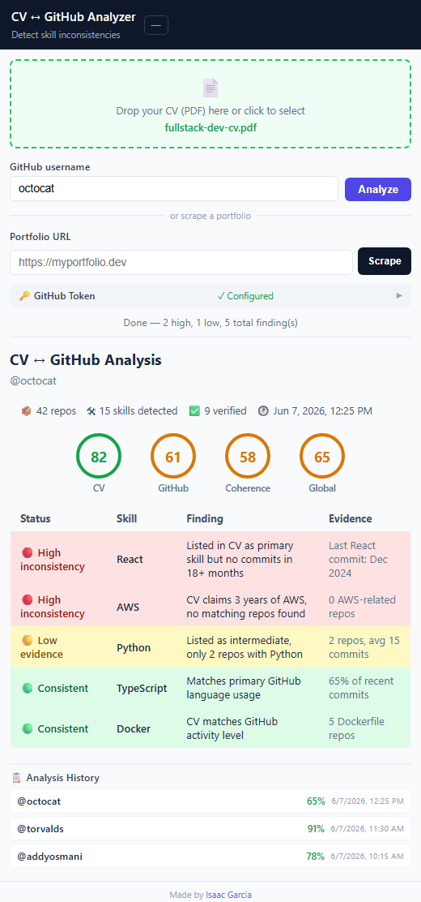

# CV ↔ GitHub Analyzer

[](https://github.com/Isaacxiddd/cv_github_analyzer/actions)
[](LICENSE)
[](https://www.typescriptlang.org/)
[](https://developer.chrome.com/docs/extensions/mv3/)

> **Evidence-based CV verification in the browser.**
>
> CV ↔ GitHub Analyzer is a Chrome extension that cross-checks a PDF CV against a GitHub profile and highlights inconsistencies, missing evidence, and repository quality signals — entirely inside the browser, without uploading documents to external servers.

---

## The Problem

Recruiters and hiring managers frequently need to determine whether the information presented in a CV is supported by public technical evidence.

This process is usually manual, inconsistent, and time-consuming.

Common examples:

- "Expert in React" but no visible React repositories
- "5 years of Python experience" but GitHub activity suggests otherwise
- Skills listed without supporting projects
- Open-source claims that are difficult to verify quickly
- Large numbers of applicants with limited time for review

While GitHub contains useful signals, extracting them manually requires opening profiles, inspecting repositories, reviewing activity, and making subjective judgments.

---

## The Solution

CV ↔ GitHub Analyzer automates that first-pass verification process.

The extension:

1. Parses a PDF CV
2. Extracts skills, dates, links, and technical claims
3. Fetches public GitHub profile data
4. Analyzes repositories and activity
5. Cross-checks CV claims against public evidence
6. Generates a report with transparent findings

All processing happens locally in the browser.

<p align="center">
  
</p>

---

## Example Findings

```text
🔴 [NO_REPOS]
"Expert React"
→ No React repositories detected

🔴 [YEARS_MISMATCH]
"5 years Python experience"
→ GitHub activity does not support the claimed timeline

🟡 [INACTIVE]
No commits detected in the last 6 months

🟢 [VERIFIED]
TypeScript usage confirmed across recent repositories
```

The goal is not to replace recruiters.

The goal is to provide evidence-based signals that make technical screening faster and more consistent.

---

## Key Features

### CV Analysis

- PDF text extraction
- Technical skill detection
- Experience timeline extraction
- URL and portfolio discovery
- GitHub link detection

### GitHub Analysis

- Public profile analysis
- Repository language statistics
- Activity and commit recency
- README detection
- Test folder detection
- CI/CD workflow detection
- Repository quality signals

### Cross-Checking Engine

- Skill verification
- Experience consistency checks
- Repository evidence matching
- Activity validation
- Multiple rule-based checks

See the full rule catalog in:

- [docs/rules.md](docs/rules.md)

---

## Why It Matters

### For Recruiters

- Reduce manual profile inspection
- Validate claims faster
- Surface objective technical signals
- Standardize early-stage screening

### For Developers

- Verify that a CV matches public evidence
- Identify weak or unsupported claims
- Improve portfolio credibility
- Understand how recruiters may perceive a profile

---

## Privacy First

Privacy was a core design requirement.

### Local Processing

✅ CV remains on the user's device

✅ Extracted data remains local

✅ No backend required

✅ No tracking

✅ No analytics

### External Requests

Only public GitHub API endpoints are used when retrieving profile information.

No CV content is transmitted externally.

For additional details:

- [docs/privacy.md](docs/privacy.md)

---

## Architecture

The project follows a modular architecture with clear separation of responsibilities.

### Main Components

| Component | Responsibility |
|------------|----------------|
| parser | PDF parsing and data extraction |
| analyzer | GitHub analysis and rule evaluation |
| report | Report generation |
| popup | Extension user interface |
| background | Service worker orchestration |
| content | GitHub page integration |
| tests | Automated test suite |

### Data Flow

```text
PDF
 ↓
Parser
 ↓
CV Extractor
 ↓
GitHub Fetcher
 ↓
Cross-Check Engine
 ↓
Report Generator
 ↓
UI
```

Additional documentation:

- [docs/architecture.md](docs/architecture.md)
- [docs/decisions.md](docs/decisions.md)

---

## Tech Stack

### Frontend

- TypeScript
- Chrome Extension Manifest V3

### Parsing

- pdf.js

### Testing

- Vitest

### Build System

- esbuild

---

## Project Status

### Current Version

✅ Chrome Extension MVP

✅ PDF Parsing

✅ GitHub Analysis

✅ Rule-Based Verification

✅ Unit Testing

✅ Local Processing

### Planned

- GitHub OAuth support
- Enhanced repository analysis
- Additional verification rules
- Optional AI-generated summaries
- Recruiter-oriented dashboard

See:

- [ROADMAP.md](ROADMAP.md)

---

## Quick Start

### Installation

```bash
cd extension
npm install
npm run build
```

### Load Extension

1. Open `chrome://extensions`
2. Enable **Developer Mode**
3. Click **Load unpacked**
4. Select `extension/dist`

---

## Usage

1. Open the extension
2. Upload a PDF CV
3. Enter a GitHub username
4. Click **Analyze**
5. Review generated findings

---

## Development

```bash
npm install

npm run build
npm run dev

npm run test
npm run typecheck
npm run lint
```

---

## Repository Structure

```text
extension/
├── src/
│   ├── types/
│   ├── data/
│   ├── parser/
│   ├── analyzer/
│   ├── report/
│   ├── popup/
│   ├── background/
│   └── content/
│
├── tests/
│   ├── fixtures/
│   ├── cv-extractor.test.ts
│   ├── cross-checker.test.ts
│   └── report-generator.test.ts
│
└── build.ts
```

---

## Documentation

- [Architecture](docs/architecture.md)
- [Engineering Decisions](docs/decisions.md)
- [Rules Catalog](docs/rules.md)
- [Privacy](docs/privacy.md)
- [Roadmap](ROADMAP.md)
- [Contributing](CONTRIBUTING.md)

---

## Contributing

Bug reports, feature requests, and pull requests are welcome.

See:

- [CONTRIBUTING.md](CONTRIBUTING.md)

---

## License

Licensed under the Apache License 2.0.

© 2025 Isaac Garcia
